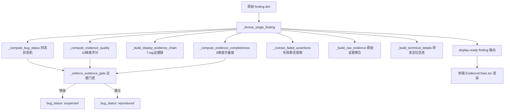

## 用户需求

用户要求把证据链能力优化成"业务、测试、研发都能一眼看懂"的缺陷证据系统。核心原则：没有证据就不能叫已复现 Bug；已复现 Bug 必须有完整证据链；风险线索、疑似问题、规则命中、模型推断不能和已复现 Bug 混在一起；证据必须可追溯、可复现、可解释、可对比；不允许伪造证据。

## 产品概述

在现有 display-ready 架构基础上，将缺陷从"有结论无证据"升级为"四态分级+五层证据+完备度门控"的企业级缺陷证据系统。后端统一输出四态 Bug 状态和五层证据结构，前端按状态差异化展示并强制标注证据缺口，让业务、测试、研发三个角色各自一眼看懂。

## 核心功能

- 四态 Bug 状态体系：已复现/疑似/风险线索/未复现，有明确条件门槛和自动降级逻辑
- 五层证据结构：缺陷摘要 + 业务视角 + 测试视角 + 研发视角 + 原始证据
- 证据完备度门控：不满足"已复现"条件自动降级为"疑似"或"风险线索"
- 10 维度证据质量评分：90-100 可交付/70-89 较完整/40-69 疑似/0-39 风险线索
- 前端状态标签 + 证据质量分 + 一句话业务影响 + 关键失败断言，详情按状态差异化展示
- 疑似 Bug 明确提示"证据不足"，风险线索明确提示"需要继续验证"

## Tech Stack

- 后端：Python 3.12+，`display_ready_formatter.py` 层重构（不修改 har_bridge/deep_verifier/replay_engine 输出结构）
- 前端：React 19 + TypeScript 5 + 自定义 CSS（保持现有架构，无组件库）
- 数据流：后端 display-ready JSON → 前端零加工纯渲染

## Implementation Approach

### 核心策略：在 formatter 层引入四态状态机和五层证据结构，不改数据源

当前 `_format_single_finding()` 输出的 `verdict` 只有 "confirmed"/"pending" 二元值，`evidence_status` 四层状态前端完全不渲染，没有证据完备度门控。本次重构在 formatter 层从已有字段计算四态状态、提取五层证据、增加门控逻辑，后端统一输出，前端按状态差异化展示。

### Bug 四态状态机（后端 `_compute_bug_status()` 新增）

```
已复现 (reproduced)：
  条件：evidence_quality.score >= 70
  AND 有真实运行时证据 (har_evidence.status_code 或 evidence.response)
  AND 有预期+实际对比 (expected + actual 均非空)
  AND 有复现路径 (repro_path 非空)

疑似 (suspected)：
  条件：score >= 40 但不满足"已复现"全部条件
  OR 有部分运行时证据但缺少关键复现证据

风险线索 (risk_clue)：
  条件：score < 40
  OR 只有规则/模型/静态分析发现，无真实执行

未复现 (not_reproduced)：
  条件：执行过但未触发异常
  OR finding 原始状态为 falsified/inconclusive
```

状态优先级：原始 finding 的 `final_review_status` > `bug_confirmation` > 门控计算结果。如果原始状态是 REJECTED/BLOCKED，保留原状态不被覆盖。

### 五层证据结构（后端 `_format_single_finding()` 输出扩展）

| 层 | 字段 | 数据来源 |
| --- | --- | --- |
| 缺陷摘要 | bug_status, confidence, evidence_quality_score, evidence_completeness, business_summary, is_reproducible | 已有字段聚合 |
| 业务视角 | business_impact (已有), affected_scope (新增) | business_impact + affected_instances |
| 测试视角 | reproduction_steps (已有), expected_actual_comparison (新增), failed_assertions (新增) | expected + actual + evidence |
| 研发视角 | technical_details (新增), recommended_fix (新增), regression_suggestions (新增) | investigation_guidance + risk_type |
| 原始证据 | raw_evidence (新增) | har_evidence + evidence + source_file |


### 证据完备度门控（`_enforce_evidence_gate()` 新增）

在 `_format_single_finding()` 最后阶段，如果计算出的 bug_status 是 "reproduced" 但证据不完备（缺少 reproduction_steps / expected / actual / 任何运行时证据），自动降级为 "suspected"，并在 `evidence_status.gate_downgrade_reason` 记录降级原因。

### 10 维度证据质量评分（`_compute_evidence_quality()` 扩展）

当前已有 9 维度评分。新增第 10 维度 `has_assertion`（有失败断言 +5 分），从 evidence.actual 和 expected 的差异中提取断言点。

### 通用性保证

- 状态判断基于通用字段（score/har_evidence/expected/actual/repro_path），不硬编码业务概念
- 失败断言从 actual_behavior 文本中通用提取（如"返回200"→"应返回403"的模式匹配）
- 修复建议从 risk_type 和 defect_family 通用映射，不硬编码业务术语

## Implementation Notes

- **向后兼容**：新字段全部可选，`verdict` 保留但映射到四态（confirmed→reproduced, pending→根据 score 细分）
- **不修改数据源**：只在 formatter 层从已有字段提取，不改 har_bridge/deep_verifier/replay_engine
- **性能**：状态计算和证据提取都是 O(1) 字段查找，无额外 IO
- **语法检查**：每次修改 Python 文件后 `python -c "import ast; ast.parse(...)"`
- **通用正则**：断言提取用通用模式（"应返回"/"应拒绝"/"应为"/"不应"等），不硬编码业务术语
- **Blast radius**：新增字段不影响现有 API 消费者，旧字段保留

## Architecture Design



## Directory Structure

```
ai_test_asset_center/
├── display_ready_formatter.py    # [MODIFY] 新增 _compute_bug_status()、_enforce_evidence_gate()、_extract_failed_assertions()、_build_raw_evidence()、_build_technical_details()；扩展 _format_single_finding() 输出 bug_status/confidence/business_summary/test_summary/dev_summary/raw_evidence/failed_assertions/recommended_fix/regression_suggestions/expected_actual_comparison；扩展 _compute_evidence_quality() 增加 has_assertion 维度

frontend/src/
├── types/
│   └── index.ts                  # [MODIFY] Finding 新增 bug_status(四态)/confidence/business_summary/test_summary/dev_summary/raw_evidence/failed_assertions/expected_actual_comparison/recommended_fix/regression_suggestions/affected_scope/is_reproducible；EvidenceQuality 新增 has_assertion 维度
├── components/
│   └── EvidenceTimeline.tsx      # [MODIFY] 无需大改，已支持 7-tag 差异化渲染
├── pages/
│   └── EvidenceChain.tsx         # [MODIFY] 顶部统计按四态分组（已复现/疑似/风险线索）；finding 卡片头部新增四态状态标签+证据质量分徽章+一句话业务影响+失败断言摘要；疑似/风险线索增加降级提示横幅；测试视角增加预期vs实际对比+失败断言；研发视角增加修复建议+回归测试建议
└── index.css                     # [MODIFY] 四态状态标签样式(reproduced绿/suspected橙/risk_clue灰/not_reproduced蓝)、降级提示横幅样式、失败断言样式、修复建议卡片样式
```

## Key Code Structures

```typescript
// Finding 新增字段（types/index.ts）
export interface Finding {
  // ... 现有字段保留 ...

  // 四态 Bug 状态（新增，替代 verdict 的二元值）
  bug_status: 'reproduced' | 'suspected' | 'risk_clue' | 'not_reproduced';
  confidence: number;  // 0-100 复现置信度

  // 五层证据结构（新增）
  business_summary: string;       // 一句话业务影响
  test_summary: string;           // 一句话测试结论
  dev_summary: string;            // 一句话研发定位
  is_reproducible: boolean;       // 是否可复现
  affected_scope: string;         // 影响范围一句话

  // 测试视角增强（新增）
  expected_actual_comparison: {
    expected: string;
    actual: string;
    difference: string;           // 差异描述
  };
  failed_assertions: Array<{
    assertion: string;            // 断言描述
    expected: string;
    actual: string;
    severity: 'critical' | 'major' | 'minor';
  }>;

  // 研发视角增强（新增）
  technical_details: {
    api_endpoint: string;
    method: string;
    status_code: number;
    response_excerpt: string;
    relevant_tables: string[];
    trace_id: string;
    root_cause_hint: string;
  };
  recommended_fix: string;
  regression_suggestions: string[];

  // 原始证据（新增）
  raw_evidence: {
    request: Record<string, unknown> | null;
    response: Record<string, unknown> | null;
    logs: string | null;
    db_snapshot: Record<string, unknown> | null;
    source_file: string | null;
    timestamp: string | null;
    trace_id: string | null;
    source_engine: string | null;
  };
}
```

## 设计风格

在现有企业级数据看板基础上，引入四态状态色彩编码体系，让企业用户一眼区分"已复现/疑似/风险线索/未复现"。证据卡片头部重构为"状态标签 + 证据质量分 + 一句话业务影响"三件套，详情区按状态差异化展示——已复现 Bug 用强证据展示，疑似 Bug 必须标注"证据不足"降级横幅，风险线索必须标注"需要继续验证"。

### 页面结构优化

**统计栏重构**：当前"证据链总数/可交付证据/待补强证据/仅风险线索/闭环率"改为按四态分组——已复现(绿)/疑似(橙)/风险线索(灰)/未复现(蓝)，让企业一眼看到缺陷分布。

**证据卡片头部**（展开前）：

- 左侧：严重度色条 + 四态状态标签（彩色圆点+文字）+ 标题
- 中间：证据质量分徽章（圆形分数+颜色编码）+ 一句话业务影响
- 右侧：涉及接口 + 复现稳定性 + 时间戳

**降级提示横幅**：疑似 Bug 和风险线索在卡片展开后顶部显示横幅——"当前证据不足以标记为已复现 Bug，缺少：xxx、xxx"，用橙色/灰色背景区分。

**三视角 Tab 增强**：

- 业务视角：新增"失败断言摘要"区块（最关键的1-2条断言）+ 影响范围
- 测试视角：新增"预期 vs 实际对比"结构化卡片 + "失败断言列表"
- 研发视角：新增"修复建议"卡片 + "回归测试建议"列表

### 配色方案

四态状态色彩编码：

- 已复现 (reproduced)：绿色系 #059669，表示证据完整可交付
- 疑似 (suspected)：橙色系 #D97706，表示需要补充证据
- 风险线索 (risk_clue)：灰色系 #64748B，表示需要继续验证
- 未复现 (not_reproduced)：蓝色系 #3B82F6，表示执行未触发

## Agent Extensions

### SubAgent

- **code-explorer**
- Purpose: 在实现阶段深入排查 evidence_models.py、discovery_finding_gate.py、bug_validation_queue.py 等状态定义文件，确认四态状态机与现有四层证据状态的映射关系
- Expected outcome: 确认四态状态不与现有 RAW_RUNTIME_VERDICTS/SEMANTIC_VERDICTS/BUSINESS_EVIDENCE_STATUS/FINAL_REVIEW_STATUS 冲突，找到正确的映射点