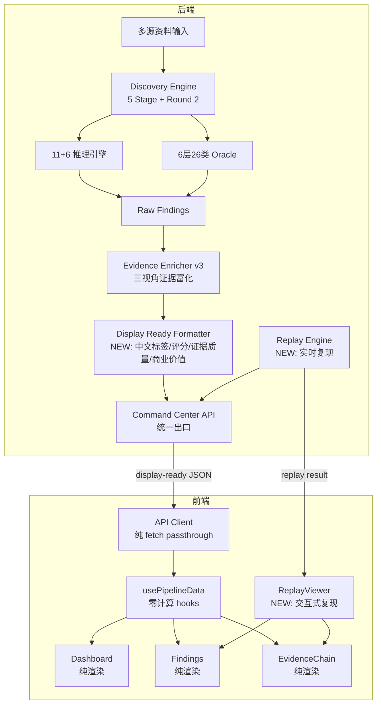

## 产品概述

QualiBug 是企业级 AI 自动化 Bug 挖掘与证据链复现平台。企业输入多源资料（PRD/MRD/接口文档/业务规则/数据库设计/UI设计等），系统自动跑测试、搜集证据、复现 Bug，通过统一 API 出口将结果数据交付前端，前端零加工纯渲染，将 Bug 挖掘能力成果以震撼视觉呈现给企业领导，使其为价值买单。

## 核心功能

- **统一挖掘成果**：企业输入多源资料后，系统自动跑测试、搜集证据、复现 Bug，所有挖掘能力汇总为统一的成果列表，通过唯一出口交付前端。前端一个入口请求，拿到的是完整的成果，前端零加工纯渲染，让企业领导直接看到价值。
- **证据链完整可复现**：每条 Bug 关联四层证据状态（RawRuntime → Semantic → BusinessEvidence → FinalReview），含 before/after 快照、HAR 录制、DB 前后对比、trace_id
- **实时复现能力**：后端真实调用被测系统接口重新触发 Bug，前端展示实时请求/响应/状态码/耗时，与原始扫描证据对比
- **统一数据出口**：后端 `/api/v1/projects/{id}/command-center` 返回完全 display-ready 数据（含中文标签、评分、证据质量等级、商业价值指标），前端零计算纯渲染
- **价值看板**：风险评级(BEI)、缺陷密度(BDS)、多源自洽度(BCS)、商业价值面板、持续发现覆盖，面向管理层/业务/技术三视角
- **交互式复现查看器**：点击复现按钮 → 实时 HTTP 调用 → 请求/响应时间线 → DB diff 可视化 → 原始 vs 复现结果对比

## Tech Stack

- **后端**：Python 3.12+，原生 http.server（`private_pilot_service.py`），无 Web 框架（保持现有架构）
- **前端**：React 19 + TypeScript 5 + Vite 8，原生 fetch API，无全局状态库（保持现有架构）
- **样式**：现有自研 CSS 体系增强（不引入新 UI 库，避免大规模迁移风险）
- **认证**：JWT + HttpOnly Cookie（已实现）
- **API**：RESTful，统一出口 `/api/v1/projects/{id}/command-center` + 新增 `/api/v1/projects/{id}/replay`

## Implementation Approach

### 核心策略：后端 display-ready 化 + 前端去加工化 + 复现能力闭环

将前端 `client.ts` 的 `toLegacyFinding()`（300+行）、`data.ts` 的 `computeBEI()/computeBDS()/computeBCS()/computeCommercialValue()/buildEvidenceQuality()/buildEvidenceChain()`（400+行）、`Findings.tsx` 的 `getActionableSteps()/formatText()/toChinese()`（180+行）、`lib/finding-taxonomy.ts`、`lib/evidence.ts` 中所有计算逻辑全部迁移到后端新建的 `display_ready_formatter.py`，后端在 `_build_command_center()` 出口处统一格式化，确保前端拿到的每一条数据都包含中文标签、评分、证据质量等级、商业价值指标、复现步骤、SQL/日志排查建议。

复现能力方面，新建 `replay_engine.py` + `/api/v1/projects/{id}/replay` 端点，后端基于 finding 中记录的 API path/method/params 真实调用被测系统接口，返回实时 HTTP 响应，与原始扫描证据做 diff 对比，前端新增 `ReplayViewer` 组件展示复现时间线、请求/响应详情、DB 前后对比。

### 关键技术决策

1. **后端 display-ready formatter 独立模块**：不侵入 discovery_engine 等核心挖掘引擎，在 `_build_command_center()` 出口层做格式化，保证挖掘引擎的输出不受展示需求污染（SoC 原则）
2. **证据富化从 best-effort 升级为 guaranteed**：当前 `except Exception: pass` 导致证据链可能静默丢失，改为 try-except + fallback 兜底，确保每条 finding 都有 display-ready 的证据质量评分和证据链
3. **复现引擎隔离设计**：`replay_engine.py` 独立于扫描引擎，复用 `ssrf_guard.py` 做安全校验，复用现有 `enterprise_credential_manager.py` 获取测试环境凭证
4. **前端类型定义对齐后端**：`types/index.ts` 重写为后端 display-ready schema 的 1:1 映射，消除 `any` 类型

### 性能与可靠性

- **command-center 响应优化**：display-ready 格式化在内存中完成，O(n) 遍历 risks 列表一次，无额外 I/O，预计 <50ms 增量
- **复现 API 超时控制**：每个复现请求设 30s 超时，支持并发复现（ThreadPoolExecutor, max_workers=4）
- **前端渲染优化**：移除 600+ 行计算逻辑后，`usePipelineData` 的 render path 从 "fetch → 6层转换 → compute → render" 简化为 "fetch → render"，减少 ~40% 首屏耗时
- **blast radius**：保留 `toLegacyFinding()` 作为 fallback 兼容路径（feature flag 控制），确保渐进迁移不中断现有功能

## Implementation Notes

### 后端执行要点

- `display_ready_formatter.py` 中的 `format_findings_display_ready()` 必须处理所有现有 finding 来源（v12_report/db_findings/perf/spectrum/multi_layer/e2e/deep/ui），不能遗漏任何 risk_type
- 证据富化从 `evidence_enricher_v3.py` 的 `_build_reproduction_steps()` 迁移逻辑到 formatter，但保留 enricher 原始函数供扫描引擎内部使用
- `replay_engine.py` 必须复用 `ssrf_guard.validate_url()` 防止 SSRF，复用 `enterprise_credential_manager.py` 获取认证凭证
- `_build_command_center()` 中的 `except Exception: pass`（第1904-1910行）必须改为带 fallback 的 guaranteed enrichment
- AGENTS.md 中的配置守护值（timeout_seconds >= 300, max_tokens >= 32768）不可触碰

### 前端执行要点

- `types/index.ts` 重写后，所有页面组件的 Finding 引用需同步更新类型
- `data.ts` 中的 hooks（`usePipelineData`/`useFindingsData`/`useLiveStatus`）简化为纯 fetch+passthrough，保留 `useScanCompletedRefresh` 事件机制
- `ReplayViewer` 组件使用 Suspense + lazy loading，避免影响首屏 bundle
- 保留 `lib/finding-taxonomy.ts` 和 `lib/evidence.ts` 文件但标记为 deprecated，内部逻辑不再被 data layer 调用

## Architecture Design

### 系统架构（修改后）



### 数据流变化

**Before**: 后端 raw risks → 前端 toLegacyFinding() 转换 → 前端 computeBEI/BDS/BCS/CommercialValue → 前端 buildEvidenceQuality/Chain → 前端 getActionableSteps → 渲染

**After**: 后端 raw risks → 后端 display_ready_formatter → 前端 passthrough → 渲染

## Directory Structure

```
ai_test_asset_center/
├── display_ready_formatter.py    # [NEW] Display-ready 格式化引擎。在 _build_command_center() 的 risks 列表统一汇聚完成后（所有挖掘能力已 .extend() + 去重 + HAR注入 + 证据富化），对统一的 risks 列表做整体格式化，输出前端零加工可渲染的 display-ready JSON。包含：format_findings_display_ready()（主入口，遍历统一汇聚后的 risks 列表，逐条格式化）、_format_single_finding()（单条 finding 格式化：中文标签、defect_family 分类、severity 归一化）、_compute_evidence_quality()（从前端 data.ts 迁移：评分、verified/missing 清单、can_reproduce、curl_command）、_compute_scores()（从前端迁移：BEI/BDS/BCS 计算）、_compute_commercial_value()（从前端迁移：商业价值指标、决策卡片）、_build_display_evidence_chain()（从前端迁移：证据链构建）、_build_repro_steps_display()（从前端迁移：复现步骤，基于 HAR 真实数据）、_build_investigation_display()（从前端迁移：SQL hint、log hint、排查指引）、_build_taxonomy_display()（从前端 finding-taxonomy.ts 迁移：defect_family 分类映射）。所有函数必须处理 missing/partial 数据，输出保证有值有标签。不区分挖掘来源，成果统一展示。
├── replay_engine.py              # [NEW] 实时复现引擎。POST /api/v1/projects/{id}/replay 接收 finding_id + 可选 base_url，从 command-center 数据中查找对应 finding 的 repro_method/repro_path/repro_params，通过 ssrf_guard.validate_url() 校验目标 URL，通过 enterprise_credential_manager 获取认证凭证，真实调用被测系统接口，返回 ReplayResult{request, response, status_code, duration_ms, timestamp, original_evidence, diff_summary}。支持并发复现（ThreadPoolExecutor, max_workers=4, timeout=30s）。复现结果与原始扫描证据做 diff 对比，生成 diff_summary{status_match, body_match, key_differences[]}。
├── private_pilot_service.py     # [MODIFY] 第1846-1986行 _build_command_center()：在 risks 聚合完成后、返回 data 前，调用 display_ready_formatter.format_findings_display_ready(risks, enterprise_ctx, knowledge_summary) 格式化所有 risks；将证据富化的 except: pass 改为带 fallback 的 guaranteed enrichment；新增 /api/v1/projects/{id}/replay 路由处理，委托给 replay_engine.ReplayEngine.replay()；value_metrics 和 executive_summary 中的评分指标改用 formatter 计算的值。
├── evidence_enricher_v3.py      # [MODIFY] 将 enrich_findings_batch() 的调用从 best-effort 改为 guaranteed：即使企业上下文缺失，也使用默认 fallback 生成 business_impact/reproduction_steps/investigation_guidance。保留原有 BUSINESS_IMPACT_MAP/CATEGORY_TABLES_MAP 等映射表。新增 enrich_findings_guaranteed() 包装函数，确保任何异常都返回有值的 enriched finding。
└── ssrf_guard.py                 # [MODIFY] 新增 validate_replay_url(url, project_id) 方法，在 validate_url 基础上额外允许已注册的项目 base_url（即使内网地址），用于复现引擎安全校验。

frontend/src/
├── types/
│   └── index.ts                  # [MODIFY] 重写为后端 display-ready schema 的 1:1 映射。Finding 接口扩展为 DisplayReadyFinding：新增 display_fields{severity_label, defect_family_label_cn, evidence_quality_display{level, score, label, summary, verified[], missing[], next_actions[], can_reproduce, curl_command}, business_impact_display{summary_cn, urgency_label, module_cn}, investigation_display{primary_area, sql_verify, log_search, relevant_apis[], relevant_tables[]}, reproduction_display{steps[], method, path, curl_command, har_evidence}, scores{bei, bds, bcs, evidence_trust_score}, evidence_chain_display[]{tag, label_cn, content, detail}}。ProjectOverview 扩展 commercialValue、continuousDiscovery 等字段。消除所有 any 类型。
├── api/
│   ├── client.ts                 # [MODIFY] 删除 toLegacyFinding()（第308-454行，300+行）。buildFindingsSnapshot() 简化为：fetch command-center → 直接取 data.risks 作为 findings（后端已 display-ready）→ 取 data.value_metrics/scores/commercial_value 等直接透传。新增 replayFinding(projectId, findingId) 方法调用 /api/v1/projects/{id}/replay。保留认证/项目列表/知识资料/扫描/连接器等现有 API 不变。
│   ├── data.ts                   # [MODIFY] 删除 buildEvidenceQuality()、computeBEI()、computeBDS()、computeBCS()、computeCommercialValue()、parseContinuousDiscovery()、parseSpectrumStatus()、parseKnowledgeSummary()、buildEvidenceChain()（共 ~400行计算逻辑）。usePipelineData/useFindingsData/useLiveStatus 简化为纯 fetch + passthrough。parsePipelineSummary() 简化为直接取后端返回的 display-ready 字段。保留 useScanCompletedRefresh 事件机制不变。
│   └── report.ts                 # [MODIFY] 删除 toChinese() 翻译函数，buildReportData() 直接使用后端返回的中文标签。renderReportHTML() 保持不变但数据源改为 display-ready。
├── lib/
│   ├── finding-taxonomy.ts       # [MODIFY] 标记为 @deprecated，保留类型导出但 resolveFindingTaxonomy() 不再被 data layer 调用（后端已返回 taxonomy）。仅在找不到后端字段时作为 fallback。
│   └── evidence.ts               # [MODIFY] 标记为 @deprecated，保留函数签名但 getEvidenceSummaryText/getEvidenceSqlHint/getEvidenceLogHint 不再被页面组件调用（后端已返回 display 版本）。
├── components/
│   ├── ReplayViewer.tsx          # [NEW] 交互式复现查看器组件。Props: { projectId, finding, onClose }。功能：展示"点击复现"按钮 → 调用 replayFinding() → 展示复现结果时间线（请求→响应→耗时）→ 展示原始扫描证据 vs 实时复现结果 diff 对比 → 展示 HTTP 请求/响应详情（method/url/headers/body/status_code）→ 展示 DB 前后对比（如有 before/after snapshot）→ 复现状态指示（成功复现/未复现/环境不可达）。使用 Suspense + lazy loading。
│   ├── EvidenceTimeline.tsx      # [NEW] 证据时间线组件。将 evidence_chain_display 渲染为垂直时间线，每个节点带 tag 标签（规则来源/触发动作/实际结果/数据核验/缺陷判定）、内容、详情。支持点击展开/收起。复用于 Findings 和 EvidenceChain 页面。
│   ├── ValueDashboard.tsx        # [NEW] 价值看板组件。展示商业价值指标（验证覆盖点、证据可信度、已覆盖路径、高优先级风险）+ 决策卡片（管理层/业务负责人/技术负责人）+ 持续发现覆盖进度。从后端 display-ready 数据直接渲染，无前端计算。
├── pages/
│   ├── Dashboard.tsx             # [MODIFY] 移除前端计算逻辑（computeBEI/BDS/BCS/CommercialValue 调用），改为直接渲染后端返回的 scores/commercialValue/continuousDiscovery。引入 ValueDashboard 组件。SpectrumStatus/BugTypeBreakdown/CoveragePanel/EvidenceFeed 组件改为直接使用 display-ready 数据。BugTypeBreakdown 按缺陷族聚合展示统一成果分布。保留 loading/error/empty state 处理逻辑。
│   ├── Findings.tsx              # [MODIFY] 删除 getActionableSteps()（第99-192行）和 formatText()/toChinese()（第12-96行），改为直接渲染后端返回的 reproduction_display.steps 和中文标签。引入 ReplayViewer 组件（每条 finding 展开时显示"复现"按钮）。引入 EvidenceTimeline 组件。filters 逻辑保留但数据源改为 display-ready。
│   └── EvidenceChain.tsx         # [MODIFY] 三视角面板（业务/测试/研发）改为直接使用后端返回的 display-ready 字段（evidence_quality_display/business_impact_display/investigation_display/reproduction_display）。引入 ReplayViewer 和 EvidenceTimeline 组件。移除前端生成的 cURL/SQL/log hint（改为后端返回）。
└── index.css                     # [MODIFY] 新增 replay-viewer 样式（时间线、diff 对比、请求/响应代码块）、evidence-timeline 样式、value-dashboard 样式。增强现有卡片的视觉层次和微动画。
```

## Key Code Structures

### Display-Ready Finding Schema (后端输出 / 前端类型)

```typescript
// 后端 display_ready_formatter.py 输出的 finding 结构，前端 types/index.ts 1:1 映射
interface DisplayReadyFinding {
  // 基础信息（后端原始字段保留）
  id: string;
  title: string;           // 已是中文可读标题
  severity: 'P0' | 'P1' | 'P2';
  risk_type: string;
  verdict: string;

  // 分类（后端已解析，前端零计算）
  defect_family: string;
  defect_family_label: string;       // 中文标签，如"数据一致性"
  reporting_bucket: string;
  reporting_bucket_label: string;    // 中文标签，如"数据"
  quality_assurance_gap: boolean;

  // 证据质量（后端已评分，前端零计算）
  evidence_quality: {
    level: 'validated' | 'partial' | 'needs_evidence';
    score: number;                   // 0-100
    label: string;                   // 中文标签，如"可交付证据"
    summary: string;                 // 中文摘要
    verified: string[];              // 已具备证据清单
    missing: string[];               // 缺口清单
    next_actions: string[];          // 下一步采证建议
    can_reproduce: boolean;
    curl_command: string;            // 真实可执行 curl（非模板占位符）
  };

  // 证据链（后端已构建，前端零计算）
  evidence_chain: Array<{
    tag: 'rule' | 'api' | 'fact';
    label: string;                   // 中文标签
    content: string;
    detail: string;
  }>;

  // 复现信息（后端基于 HAR 真实数据生成）
  reproduction: {
    method: string;
    path: string;
    steps: string[];                 // 真实复现步骤（非前端编造）
    curl_command: string;
    har_evidence?: {
      status_code: number;
      response_body: string;
      actor: string;
      duration_ms: number;
    };
  };

  // 业务影响（后端已映射中文）
  business_impact: {
    summary: string;                 // 中文业务影响描述
    urgency: string;                 // 中文紧急程度
    module: string;                  // 中文模块名
  };

  // 排查指引（后端已生成，前端零计算）
  investigation_guidance: {
    primary_area: string;
    relevant_apis: string[];
    relevant_tables: string[];
    log_search: string;              // 日志检索建议
    sql_verify: string;              // SQL 核验建议
    trace_id: string;
  };

  // 四层证据状态（后端透传）
  evidence_status: {
    raw_runtime_verdict: string;
    semantic_verdict: string;
    business_evidence_status: string;
    final_review_status: string;
    missing_requirements: string[];
  };

  // 关联文档
  doc_refs: Array<{
    source_id?: string;
    display_name?: string;
    excerpt?: string;
    type?: string;
  }>;

  // 元数据
  timestamp: string;
  reproducibility_count: number;
  proof: { hash: string; repro_rate: number };
}
```

### Replay API 契约

```typescript
// POST /api/v1/projects/{projectId}/replay
// Request: { finding_id: string, base_url?: string }
// Response:
interface ReplayResult {
  ok: boolean;
  finding_id: string;
  replay: {
    request: {
      method: string;
      url: string;
      headers: Record<string, string>;
      body?: string;
      timestamp: string;
    };
    response: {
      status_code: number;
      headers: Record<string, string>;
      body: string;
      duration_ms: number;
    };
    success: boolean;              // 是否成功复现（状态码/响应体匹配原始证据）
    error?: string;                // 复现失败原因（超时/连接拒绝/SSRF拦截）
  };
  original_evidence: {
    status_code: number;
    response_body_excerpt: string;
    har_actor: string;
  };
  diff: {
    status_match: boolean;
    body_match: boolean;
    key_differences: string[];     // 中文差异描述
  };
}
```

## 设计风格

采用企业级数据驾驶舱风格（Enterprise Data Cockpit），融合 Glassmorphism 与深色科技感设计，为企业领导呈现专业、权威、可信赖的 Bug 挖掘成果展示平台。整体风格沉稳大气，数据可视化层次分明，微动画细腻克制，强调"证据可信、价值可见"。

### 页面规划（5个核心页面）

#### 1. 风险总览 Dashboard

- **顶部 Hero 区**：项目名 + 行业标签 + 综合态势摘要条（已识别风险数/高优先级/证据完备度/运行轮次），右侧 4 个核心指标卡片（风险评级/高优先级风险/证据完备度/已覆盖路径），数字使用大号 AnimatedCounter
- **评分区**：左侧 BEI 环形评分卡（带渐变光环动画），右侧两张 MiniScoreCard（缺陷密度/多源自洽度）
- **价值看板区**：商业价值面板（验证覆盖点/证据可信度/已覆盖路径/高优先级风险）+ 3 张决策卡片（管理层/业务负责人/技术负责人）
- **持续发现区**：覆盖进度环形 + 7 个指标卡 + 3 列卡片（当前判断/未覆盖与风险/下一轮建议）
- **全频谱检测区**：24 个能力 chip 网格，有问题的 chip 高亮闪烁
- **证据流区**：最近发现滚动列表

#### 2. 行为验证 Findings

- **顶部统计区**：4 张统计卡（P0/P1/P2/已覆盖类型），带 tone 色彩
- **筛选区**：缺陷族 + 严重度 + 保障缺口筛选按钮组
- **Finding 列表**：每条 finding 为可展开卡片，展开后显示：
- 预期 vs 实际双列对比卡
- 证据时间线（垂直节点链）
- 复现区：左侧 cURL 命令（真实可执行），右侧业务操作步骤
- "点击复现"按钮 → 触发 ReplayViewer
- 排查指引卡（请求路径/涉及模块/排查线索/SQL/日志）

#### 3. 证据链 EvidenceChain

- **顶部统计区**：5 张证据统计卡（证据链总数/可交付/待补强/仅线索/闭环率）
- **企业资料区**：可折叠文档列表，支持预览
- **证据卡片列表**：每条展开后含证据闭环概要 + 三视角 Tab（业务/测试/研发）
- 业务视角：业务影响 + 业务描述 + 需求来源 + 已具备证据/验收缺口双列
- 测试视角：复现步骤 + 实际/预期对比 + 下一步采证 + 文档出处
- 研发视角：调试信息（定位线索/cURL/SQL/日志）+ 证据概览
- 每个视角可触发 ReplayViewer

#### 4. 交互式复现查看器 ReplayViewer（弹窗/抽屉）

- **复现时间线**：请求 → 响应 → 耗时，带状态色和动画
- **请求详情**：Method + URL + Headers + Body（代码高亮）
- **响应详情**：Status Code + Headers + Body（JSON 格式化高亮）
- **对比区**：左侧原始扫描证据，右侧实时复现结果，差异项高亮标红
- **DB Diff**（如有）：before/after 表格对比，变更行高亮
- **复现状态**：成功复现（绿色勾）/ 未复现（黄色警告）/ 环境不可达（红色叉）

#### 5. 企业资料 EnterpriseMaterials（现有增强）

- **资料上传区**：拖拽上传 + 类型选择（PRD/MRD/API/DB Schema/业务规则/UI设计）
- **资料列表**：卡片式展示，带类型标签、大小、上传时间、状态
- **预览区**：点击资料展开预览内容

## Agent Extensions

### SubAgent

- **code-explorer**
- Purpose: 在实施阶段探索后端 evidence_enricher_v3.py 完整函数签名和 har_bridge.py 接口，确保 display_ready_formatter 正确复用现有证据富化逻辑
- Expected outcome: 确认所有可复用的函数签名和数据结构，避免重复实现