# Benchmark 131 Phase 0/1 Capability Foundation Design

Date: 2026-07-11

Status: Written specification awaiting user review

## Decision Summary

QualiBug will use the user-supplied Windows-native 131-Bug benchmark mall as
the only near-term discovery-quality target. Cross-industry evaluation is
deferred until the product is stable; it is not removed from the long-term
commercial gate. Product runtime code must remain industry-neutral during this
single-target period, so benchmark routes, roles, values, Bug titles, match
keywords, reproduction paths, and hidden Ground Truth must not be encoded in
prompts, detectors, fixtures, Oracles, services, or UI.

The selected engineering approach is to consolidate the existing discovery
components into one authoritative experiment mainline. Existing behavior
slices may survive only as source-grounded adapters into Test Obligations.
They may not retain an independent scheduler, executor, Oracle path, or
delivery-count path.

This document uses delivery-milestone names to avoid silently changing the
phase numbering in the architecture SSOT:

- **Milestone P0 — Trusted benchmark and defect truth:** operationalizes the
  existing architecture Phase 0.
- **Milestone P1 — Executable single mainline:** includes the existing
  Behavior IR/Obligation work plus the minimum binding, fixture, campaign, and
  execution plumbing required to make that mainline real. Full adaptive
  state-space search, broad multi-surface observation, and the 90% Recall goal
  remain later milestones.

P0 and P1 are foundations for a 90% campaign. They are not themselves a claim
that 90% Recall has been achieved.

## Frozen Target Identity

The evaluator-local target root is:

```text
C:\Users\Test\Desktop\qualibug_enterprise_benchmark_v0_5_windows_native_stable\qualibug_enterprise_benchmark_v0_5_windows_native_stable
```

The directory name is not authoritative. Its manifest declares:

- target name: `QualiBug Enterprise Benchmark Mall`;
- target version: `v0.6-windows-native-stable-131bugs`;
- seeded Bug count: `131`;
- manifest SHA-256:
  `f0e7b477f3ae806b8377ec484e1d365b116291a0f82444b7786bad73d783fc99`;
- hidden `bugs.json` SHA-256:
  `4e5e5aecc95775e2838c3b50173bf73ec2a09aca3a33af6bc525e77718fb2212`.

The hidden GT fingerprint is identical to the repository evaluator-private
131-Bug GT fingerprint. This proves dataset identity without exposing GT
contents to discovery runtime.

The first supported execution mode is Windows native:

| Surface | Evaluator configuration |
|---|---|
| Customer UI | `http://localhost:3001` |
| Admin UI | `http://localhost:3002` |
| Target API gateway | `http://localhost:8080` |
| Target PostgreSQL | `localhost:5432/benchmark_mall` |
| QualiBug frontend | `http://localhost:5174` |
| QualiBug backend | `http://localhost:8088` |

These are evaluator target-profile values, not constants in active product
code. In particular, target port `8080` must never replace QualiBug backend
port `8088`.

## Runtime and Evaluator Boundary

### Runtime may receive

- the benchmark `docs/` materials;
- the two frontend URLs and API gateway URL;
- a database secret reference, not a plaintext DSN in artifacts;
- test-account secret references;
- explicit `environment_type=test` and stable target/environment identities;
- source-derived OpenAPI/API operations, roles, invariants, and runtime
  observations;
- governed fixture and cleanup capabilities exposed by the evaluator
  controller.

### Runtime may not receive

- benchmark service source code;
- `hidden_ground_truth/` paths or contents;
- `scripts/score_qualibug_output.py` or its matching behavior;
- Bug IDs, titles, match keywords, reproduction paths, scoring rules, or
  mutation metadata;
- evaluator match results or per-Bug miss labels as planner rewards.

The benchmark package's keyword scorer is diagnostic only. Formal TP, FP, FN,
Recall, and Precision use the repository's external evaluation contract and
only findings that passed the customer-delivery gate. Evaluator-private stage
loss may diagnose a completed run but cannot feed runtime planning.

## Current Evidence Baseline

The latest diagnostic receipt on the same 131-Bug GT is iteration18:

| Metric | iteration18 | best recent diagnostic, iteration17 |
|---|---:|---:|
| TP | 10 | 14 |
| FP | 44 | 24 |
| FN | 121 | 117 |
| Recall | 7.63% | 10.69% |
| Precision | 18.52% | 36.84% |
| Pipeline | `DEGRADED` | `DEGRADED` |

These receipts are diagnostics, not promotable baselines: they do not bind a
clean Git commit and clean worktree to the run receipt, and their pipeline
health is degraded. The implementation must create a new reproducible baseline
on the supplied external target before any challenger can be promoted.

The current internal funnel also establishes the P1 engineering baseline:

- 114 Test Obligations;
- 7 compiled experiments;
- 107 blocked experiments;
- 68 `BLOCKED_MISSING_BINDING`;
- 39 `BLOCKED_NON_REVERSIBLE_WRITE`;
- all 7 executed experiments are authorization experiments;
- 7 contract-Oracle findings produced 0 TP and 7 FP;
- the legacy behavior-slice path remains the source of nearly all TP.

## Approaches Considered

### A. Patch both existing execution paths

Keep the Behavior IR experiment path and legacy behavior-slice path active,
then add shared counters and more route heuristics.

Rejected because it preserves two schedulers, two completion semantics, two
finding paths, and two sources of truth. It also encourages benchmark-specific
patches and makes causal attribution of Recall changes unreliable.

### B. Replace the discovery engine in one rewrite

Build a separate stateful fuzzer and retire V12 after feature parity.

Rejected for P0/P1 because it duplicates mature governance, target policy,
redaction, delivery, evaluator, and UI projection contracts. The rewrite would
delay trustworthy measurements and create a third implementation during the
transition.

### C. Consolidate in place around existing contracts

Create Campaign and TargetPolicyDecision first, adapt all source-grounded
hypotheses into Test Obligations, materialize executable experiments through
one binding/fixture path, execute through the governed sandbox executor, and
project only one formal finding set.

Selected because it fixes the root architecture defect while preserving the
existing policy, audit, evaluator, redaction, and projection SSOTs.

## Target Architecture

```mermaid
flowchart LR
    EC["Evaluator controller<br/>asset fingerprint, health, reset"]
    RV["Redacted runtime view<br/>docs, endpoints, actor/DB secret refs"]
    CP["Campaign + TargetPolicyDecision"]
    IR["Behavior IR v2<br/>facts and causal relations"]
    OB["Test Obligations<br/>source-grounded intent"]
    AD["Legacy-slice adapter<br/>no independent execution"]
    EX["Experiment lifecycle<br/>PLANNED to terminal receipt"]
    BG["Runtime binding + Fixture DAG"]
    GE["Governed executor<br/>one receipt per write"]
    OR["Real observer receipts + assertions"]
    DG["Harness classifier + delivery gate"]
    TL["Trace Ledger + quality projection"]
    EV["External evaluator-private scoring"]

    EC --> RV --> CP --> IR --> OB --> EX --> BG --> GE --> OR --> DG --> TL --> EV
    AD --> OB
    EC --> EV
```



There is no exception-based fallback from the experiment mainline to the
legacy path. A failure becomes an explicit terminal receipt. A policy rollback
selects a previously frozen policy version before a run; it does not silently
switch engines during a run.

## Shared Data Contracts

### Evaluator target asset identity

Evaluator-private preflight produces
`qualibug.evaluator-target-asset.v1` with:

- `target_id` and `environment_id` as distinct values;
- manifest-declared version and Bug count;
- manifest, visible-input, reset-controller, scorer, and GT fingerprints;
- execution mode and configured surface endpoints;
- `environment_type=test`;
- health, reset, and cleanliness receipts;
- runtime-view fingerprint;
- explicit proof that the runtime view excludes source and hidden GT.

The asset receipt may contain GT and scorer fingerprints but never their paths
or contents in a runtime envelope or product-facing artifact.

### Run identity

Every run, trace ledger, delivery result, and evaluator submission must agree
on:

- `run_id`, `campaign_id`, `target_id`, and `environment_id`;
- Git commit SHA and `worktree_clean=true`;
- policy, source snapshot, runtime view, target asset, fixture, and reset
  fingerprints;
- schema versions for Behavior IR, Obligation, Experiment, Trace Ledger, and
  evaluator envelope.

A dirty worktree is allowed for development but is ineligible for baseline,
audit-pack, comparison, or promotion receipts. Current uncommitted user changes
remain untouched and are not silently included in a benchmark claim.

### Behavior IR v2

Runtime emits `qualibug.behavior-ir.v2`. Nodes remain content-addressed facts;
new relation records make causal meaning explicit:

```text
relation_id
relation_type = produces | consumes | transitions | permits | denies |
                owns | scopes | conserves | observes | compensates
from_ref
to_ref
operation_ref
actor_ref
preconditions[]
effects[]
source_refs[]
confidence
```

Runtime does not infer a relation from array order. An operation, entity,
actor, or invariant without sufficient source linkage remains an accepted fact
with a visible gap; it is not bound to `operations[0]` or `write_ops[0]`.

V1 input is never silently accepted as V2. A deterministic, explicitly called
migration function may convert a persisted V1 artifact; production extraction
emits V2 directly.

### Test Obligation v2

Each obligation records:

- `obligation_id`, `risk_family`, and priority;
- exact IR node and relation references;
- control and treatment intent;
- required actors, fixtures, bindings, observers, and cleanup semantics;
- assertion references and expected evidence shape;
- source lineage and explicit compile blockers.

Risk-family generation is relation-driven. P1 supports authorization,
isolation, state, validation, idempotency, concurrency, conservation, and
temporal obligation contracts, but activates an experiment only when its
required operation, actor, fixture, observer, and assertion capabilities are
source-grounded. Unsupported capability is `BLOCKED`, never guessed.

### Experiment lifecycle and terminal receipt

Every selected obligation moves through:

```text
PLANNED
  -> BINDING_READY
  -> EXECUTABLE
  -> EXECUTED
  -> VERIFIED
  -> DELIVERABLE | REJECTED
```

It may terminate at any stage as:

```text
BLOCKED(reason_code) | DEFERRED(policy_code) | HARNESS_FAILED(error_code)
```

An `EXECUTABLE` experiment contains zero unresolved placeholders. Deferred
binding slots are allowed only in `PLANNED` and `BINDING_READY`, with a named
resolver strategy and evidence source.

Every selected obligation has exactly one terminal attempt receipt for the
round. Campaign completion is derived from these receipts; aggregate positive
traffic is insufficient.

## Milestone P0 — Trusted Benchmark and Defect Truth

### P0.1 Asset preflight and evaluator isolation

Add a generic evaluator-target profile loaded from an evaluator-local path.
The profile points to the supplied target root, visible documentation,
Windows-native start/stop/health/reset commands, endpoints, and secret
references. None of these paths or commands is compiled into product runtime.

Preflight must:

1. validate the manifest fingerprint and declared 131-Bug version;
2. verify the evaluator-private GT fingerprint matches the frozen dataset;
3. verify QualiBug ports 5174/8088 are not confused with target ports;
4. verify every benchmark service, login dependency, API gateway, database,
   and declared observer is healthy;
5. reset the target through the evaluator fixture controller before replay;
6. emit a runtime-view manifest containing only allowed inputs;
7. fail closed before a scan if any identity, health, reset, or isolation check
   fails.

The evaluator reset is not a substitute for per-write cleanup. Original
cleanup failures remain recorded after a successful global reset.

### P0.2 Reproducible baseline

A baseline run is eligible only when:

- the QualiBug commit is explicit and the worktree is clean;
- target asset and runtime-view fingerprints match preflight;
- all target health checks pass before and after the run;
- target reset succeeds before the run;
- cleanup and final reset receipts are present;
- production request count and safety incidents are zero;
- usage/cost is measured or explicitly `UNKNOWN`, never synthesized as zero.

The first eligible run becomes the frozen P0 champion even if its quality is
lower than the historical diagnostic. Historical iteration17 remains a
non-promotable diagnostic guardrail: a P0 candidate may not be presented as an
improvement unless it reaches at least TP 14, FP at most 24, Recall 10.69%, and
Precision 36.84% on the same frozen 131 target.

### P0.3 Formal count SSOT

The following counts must be derived from the same current-run finding IDs:

- delivery-gate `deliverable` count;
- `formal_customer_deliverable_count`;
- evaluator-submission finding count;
- trace-ledger formal outcome count;
- UI current-run formal count.

Any disagreement is `PIPELINE_DEGRADED_COUNT_MISMATCH`, blocks evaluation
completion, and exposes the disagreeing stage counts. Historical shelf and
campaign aggregates remain separate scopes.

### P0.4 Trace ledger wiring

The exact redacted Trace Ledger object, not only a path reference, is validated
against run identity and supplied to the evaluator envelope. Persisted path and
object fingerprints must match. Stage-loss diagnostics must be `AVAILABLE` for
a measured benchmark run; `trace_ledger_missing` blocks benchmark promotion.

Miss diagnosis adds run ID, creation time, target asset fingerprint, runtime
view fingerprint, GT fingerprint, and trace-ledger fingerprint. It remains
evaluator-private and never alters discovery output.

### P0.5 Harness-failure separation

Before customer delivery, classify all of the following as non-defects:

- unresolved path, query, header, or body placeholders;
- status code zero or no real request receipt;
- required request body absent or schema-invalid;
- source-declared precondition not met;
- missing or fabricated observer evidence;
- Oracle exception or assertion-engine exception;
- fixture setup failure, cleanup failure, or dirty environment;
- missing valid positive control when the Oracle contract requires one;
- failed or unstable reproduction;
- a target 5xx caused only by an invalid harness request.

The classifier emits a stable harness error code and operator action. It must
not rewrite these cases into low-confidence Bug findings.

### P0.6 Causal defect identity

Formal dedupe uses a canonical causal signature containing:

- normalized target operation;
- actor/scope relation;
- source precondition and mutation class;
- observed business effect or violated invariant;
- Oracle contract and normalized evidence delta.

`slice_id`, title, round, request UUID, timestamp, and random resource ID are
lineage fields, not defect identity. One invalid request repeated across slices
must not create multiple findings.

### P0 exit gate

P0 is complete only when one new replay on the supplied target has:

- immutable asset, source, runtime, fixture, reset, policy, and Git identity;
- clean committed worktree;
- all services healthy before and after;
- count consistency at every formal stage;
- embedded valid Trace Ledger and available stage loss;
- zero secret/GT leakage;
- zero production requests and safety incidents;
- zero cleanup failures and dirty environments;
- `execution_success_rate >= 95%` and `engine_success_rate >= 95%`;
- every formal finding replayable with complete evidence;
- TP/FP/FN supplied only by the external evaluator.

P0 completion proves trustworthy measurement. It does not require 90% Recall.

## Milestone P1 — Executable Single Mainline

### P1.1 Campaign and policy before planning

Create `EnterpriseCampaign`, runtime identity, and `TargetPolicyDecision`
before Behavior IR construction, obligation planning, fixture setup, or any
probe. Remove post-hoc campaign-ID backfilling. A missing environment type,
environment identity, target identity, or execution approval blocks planning
or writes explicitly.

### P1.2 One scheduler and one formal path

The authoritative flow is:

```text
sources -> Behavior IR -> Test Obligations -> Experiment lifecycle
        -> governed execution -> observers/assertions -> delivery gate
```

Existing Behavior Slices and LLM hypotheses enter through an adapter that
produces source-referenced obligations. They do not execute independently.
Legacy scenario generation may remain temporarily as a pure compiler helper,
but it cannot select budget, send requests, invoke Oracles, confirm findings,
or persist a second formal count.

### P1.3 Relation-based obligation compilation

Replace positional operation selection with explicit relation joins:

- state obligations bind a declared transition to its operation and entity;
- authorization/isolation obligations preserve actor pair, tenant scope, and
  expected allow/deny direction;
- invariant obligations bind only operations that produce or consume the
  invariant's referenced state;
- validation obligations bind the exact parameter and operation source;
- idempotency/concurrency obligations require an effect observer and cleanup
  capability before compilation.

Ambiguous joins produce `BLOCKED_AMBIGUOUS_IR_RELATION` with candidate IDs.
Missing joins produce `BLOCKED_MISSING_IR_RELATION`. Neither falls back to the
first entity or operation.

### P1.4 Deferred binding and executable Fixture DAG

`build_binding_plan` returns typed slots:

```text
slot_name
location = path | query | header | body
semantic_type
resolver = prior_response | same_actor_list | governed_create |
           source_example | runtime_observer
producer_operation_ref
consumer_operation_ref
required_actor_ref
value_provenance
status = unresolved | resolved
```

Compiler accepts resolvable deferred slots in `BINDING_READY`; executor must
materialize them before `EXECUTABLE`. A fixture DAG node declares its actual
operation, actor, request source, response extraction, observer, compensation,
and dependency nodes.

The executor performs DAG setup in topological order and cleanup in reverse
accepted-write order. Every actual HTTP write passes through the governed
sandbox executor and has one audit receipt. If a write may have been accepted,
the whole scenario is never retried; accepted setup is compensated in reverse
order and the original failure is preserved.

Global reset may restore the environment but cannot erase original cleanup
failures.

### P1.5 Real observer receipts

An observer is satisfied only by a typed observation receipt. Declaring an
observer ID or receiving an unrelated HTTP response is insufficient.

P1 activates existing HTTP and DB observers when source and credentials make
them executable. UI, event, log, job, and trace observers that are not yet
integrated remain explicitly unavailable and block only obligations that
require them. Broader multi-surface discovery is a later milestone.

### P1.6 Actor-matrix preservation

Permission/isolation dedupe and scheduling identity includes:

- operation;
- control actor and treatment actor;
- tenant/ownership scope;
- expected allow/deny direction;
- target resource lineage.

Route-level collapse is permitted only after an execution plan proves it will
run the complete equivalent actor matrix. An actor-specific login scenario
cannot silently replace other actor pairs.

### P1.7 Campaign terminal semantics

Every selected obligation must have exactly one terminal receipt for the
round. Campaign may become `completed` only when:

- all selected obligations are terminal;
- no selected item lacks an execution or explicit block/defer receipt;
- every accepted write has an audit and cleanup outcome;
- the formal count consistency check passes;
- pipeline health is not degraded.

`real_trace_count > 0` is a diagnostic, never a completion condition.

### P1.8 Planner scope

P1 uses deterministic receipt-aware ranking and prevents repetition of
terminally blocked work unless its blocking input fingerprint changes. It
records compile, binding, execution, observer, gate, cost, and terminal
outcomes for later adaptive planning.

Contextual bandits, reinforcement learning, deep state-space search, and GT
feedback are explicitly outside P1. They must not be introduced before the
single mainline is trustworthy and executable.

### P1 exit gate

P1 is complete only when a challenger replay on the same frozen target has:

- one authoritative scheduler and one formal finding path;
- 100% obligation lineage to Behavior IR and source refs;
- experiment compile rate at least 90%;
- zero unresolved placeholders in executable experiments;
- 100% selected-obligation terminal-receipt coverage;
- execution and engine success each at least 95%;
- governed write receipt coverage and cleanup success each 100%;
- control/treatment evidence completeness at least 95%;
- zero permission/isolation loss from actor-matrix collapse;
- zero Oracle crashes classified as defects;
- no regression from the eligible P0 champion in TP, Recall, Precision, F1,
  reproduction, execution health, duplicate rate, safety, or cleanup;
- at least one measured quality or conversion metric improves.

P1 does not unlock a 90% claim. Its purpose is to turn the current 6.14%
compile path into a trustworthy executable foundation for later stateful
search and broader Oracles.

## Error and Observability Model

All stage failures use a versioned object containing:

```text
stage
code
status = BLOCKED | DEFERRED | HARNESS_FAILED | FAILED_SAFE
identity
retryability
operator_action
source_refs
receipt_refs
```

Errors are never replaced with empty successful objects. Logs and receipts
must expose at least the following dimensions:

- target, environment, run, campaign, round, obligation, experiment;
- risk family, entity, operation, actor pair, adapter;
- compile, binding, fixture, execution, observer, assertion, gate outcome;
- request status, accepted-write status, audit ID, cleanup outcome;
- causal defect signature and dedupe decision;
- wall-clock, request count, model usage, and known/unknown cost.

The Trace Ledger is the cross-stage join SSOT. Product UI consumes redacted
quality projections; it does not reconstruct truth from legacy counters.

## File Responsibility Map

P0 implementation is expected to modify or extend:

- `ai_test_asset_center/__main__.py`: attach exact Trace Ledger and run identity
  to the evaluation submission;
- `ai_test_asset_center/customer_delivery_gate.py`: strict harness-failure
  exclusion and causal identity requirements;
- `ai_test_asset_center/discovery_trace_ledger.py`: terminal receipt and causal
  signature projection;
- `ai_test_asset_center/discovery_quality_projection.py`: formal count SSOT;
- `ai_test_asset_center/discovery_evaluation_contract.py`: asset/run identity,
  count-consistency, Trace Ledger, health, and promotion validation;
- `ai_test_asset_center/evaluation_fixture_controller.py`: generic evaluator
  target preflight/reset/health contract;
- `benchmark_evaluator/miss_diagnosis.py`: immutable run identity fields;
- `tools/discovery_evaluation.py`: read-only preflight/inspect and evaluator
  orchestration;
- targeted P0 contract and integration tests.

P1 implementation is expected to modify or extend:

- `ai_test_asset_center/behavior_ir.py`;
- `ai_test_asset_center/test_obligation.py`;
- `ai_test_asset_center/obligation_compiler.py`;
- `ai_test_asset_center/experiment_contract.py`;
- `ai_test_asset_center/experiment_compiler.py`;
- `ai_test_asset_center/runtime_binding_graph.py`;
- `ai_test_asset_center/fixture_dag.py`;
- `ai_test_asset_center/experiment_executor.py`;
- `ai_test_asset_center/enterprise_campaign.py`;
- `ai_test_asset_center/hypothesis_slice_bridge.py`;
- `ai_test_asset_center/sandbox_write_executor.py`;
- `ai_test_asset_center/v12_pipeline.py`;
- targeted P1 unit, contract, campaign, and live benchmark tests.

No new benchmark-specific production detector, route table, role table,
fixture value table, or Oracle file is permitted.

## Verification Strategy

### Static and contract verification

- AST-parse every edited Python file immediately after each edit.
- Unit-test every new schema, state transition, failure code, and fingerprint.
- Prove redaction rejects hidden GT, scorer, source-code, and secret material.
- Prove count disagreement, dirty worktree, missing Trace Ledger, missing health,
  and cleanup failure all block claims.
- Prove V1-to-V2 migration is explicit and deterministic.
- Prove no executable experiment contains unresolved placeholders.
- Prove no selected obligation can disappear without a terminal receipt.
- Prove all actual writes use the governed sandbox executor exactly once.

### Target integration verification

The evaluator controller performs, in order:

1. asset fingerprint preflight;
2. Windows-native target reset;
3. target health and actor-login verification;
4. runtime-view materialization and leakage scan;
5. QualiBug health verification on ports 5174/8088;
6. one frozen champion replay;
7. target cleanup/reset and cleanliness verification;
8. one challenger replay on identical fingerprints;
9. final cleanup/reset and health verification;
10. external evaluator comparison.

The target itself supplies API on port 8080 and database on port 5432 in this
mode. QualiBug writes remain governed because the target is explicitly declared
`test`; localhost alone never grants write permission.

### Promotion rule during the single-target period

The 131-Bug target is an engineering held-in benchmark. A candidate is adopted
only when champion/challenger replay uses identical inputs and no measured
metric regresses. This adoption improves the held-in engineering policy; it
does not create a held-out, clean-target, cross-industry, controlled-pilot, or
GA claim.

## Rollback and Recovery

- Frozen champion and challenger policies have immutable fingerprints.
- A failed challenger is rejected before the next normal product run selects
  it; rollback is policy selection, not exception fallback.
- Partial fixture setup is compensated in reverse accepted-write order.
- Original execution and cleanup errors remain visible after target reset.
- A failed target reset, dirty environment, missing receipt, or unhealthy
  service stops evaluation as `FAILED_SAFE`.
- Existing user worktree changes are never reset, cleaned, overwritten, or
  included in a benchmark claim without a clean commit.

## Explicit Non-Goals

- Reaching 90% Recall during P0 or P1.
- Cross-industry or commercial generalization claims.
- Reading benchmark source code or hidden GT from discovery runtime.
- Encoding the 131 answers into generic product logic.
- Adding adaptive RL/bandit search before P1 exit.
- Completing UI/event/log/trace observer expansion during P1.
- Treating candidate count, 5xx count, evidence completeness, internal
  confirmation count, or keyword-scorer coverage as true Recall.
- Starting or modifying the benchmark during the design-document turn.

## Required Documentation Alignment

When implementation begins, the same change set must update:

- `AGENTS.md` with the near-term single-target sequencing decision;
- `docs/AUTONOMOUS_BUG_DISCOVERY_CAPABILITY_BREAKTHROUGH_SPEC.md` with the
  P0/P1 milestone mapping and Behavior IR v2 contract;
- `docs/DISCOVERY_HARNESS_EVOLUTION_GOAL.md` with the 131 held-in engineering
  gate while preserving cross-industry commercial gates as deferred and
  `NOT_MEASURED`.

The implementation plan is written only after this specification is reviewed
and approved.
